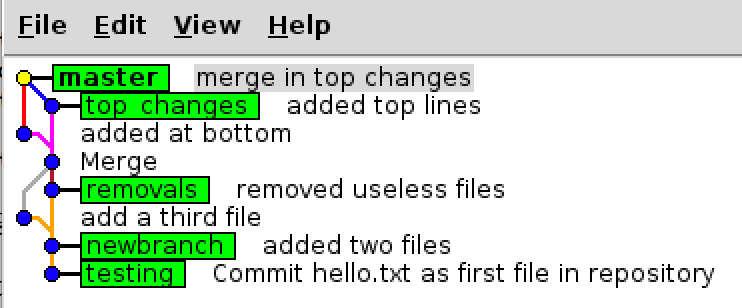
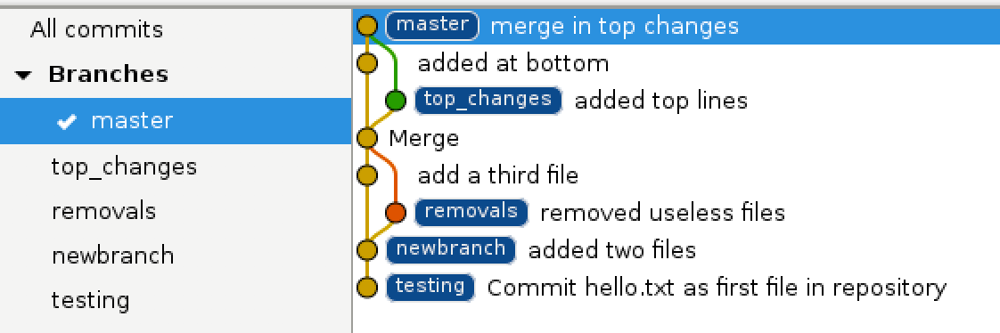

## GitBasics1: Simple uses of Git

Reminder: If there's been a correction to this exercise posted, 
update your local copy via [these instructions](https://docs.google.com/document/d/1g3b2e7wf3mWaIZ4U6MkNR5B4fQuO71y6Q341LGs45HQ/edit?usp=sharing) 
before proceeding.

Goal: Gain familiarity with basic Git use

In this exercise, we cover using Git by yourself
as a code repository for your development.

In later exercises, we cover how it can be used
collaboratively for distributed development.

Some resources you may want to refer to later on:

 - The <a href="https://www.kernel.org/pub/software/scm/git/docs/">detailed Git documentation</a>.
 - Lots of <a href="http://gitready.com">questions and answers</a> on Git usage.

See also the
<a href="ihttps://docs.google.com/document/d/1Jvb1zYRibzOw74VKnGsmTVfWkQcOxb_yc8JboebFDpA/edit#heading=h.dwvcizbspysp">Bibliography</a>

### Basic Operations

We start by telling Git who you are:
```
    git config --global user.email "you@example.com"
    git config --global user.name "Your Name"
```

There's no default for this, but you only need to do it once.

Next, we create a clean place to work:

```
    cd GitBasics1
    source setup.sh
    rm -rf exerciseG1
    mkdir exerciseG1
    cd exerciseG1
```

#### Creating a repository

Now we create a new Git repository with nothing in it:

```
    git init
    git config --global color.ui true
```

The first line creates the repository in a `.git` subdirectory. Take a moment and look at that. 
The second line turns on coloring in the output from Git.  Some people like colored output, 
some hate it; if you don't want it, omit that line or repeat is with false instead of true.

More usefully, you can ask Git about the status:

```
    git status
```

#### Committing

Now we create a first file and look to see what
Git thinks about it:

```
    echo 'Initial file: Hello World!' > hello.txt
    git status
```

An "untracked file" means that the file is there, but
that Git isn't (yet) paying attention to it.

The next step is to add the file to those that
Git is watching, also called "adding it to the index" or "staging the file":

```
    git add hello.txt
    git status
```

Finally, we tell Git to commit that file to the repository:

```
    git commit -m"Commit hello.txt as first file in repository"
    git status
```

Development continues with adding more lines to the hello.txt file.
Add a few lines at the end with your favorite editor.
When you go to commit it, though, you get:

```
$ git commit -m"Added lines at end"
# On branch master
# Changes not staged for commit:
#   (use "git add <file>..." to update what will be committed)
#   (use "git checkout -- <file>..." to discard changes in working directory)
#
#	modified:   hello.txt
#
no changes added to commit (use "git add" and/or "git commit -a")
```

and the changes are not committed!  Unlike other systems, by default
Git requires a "stage" operation before a change in the working
directory is ready to commit.
This can be very useful when working on complicated multi-file changes.
We'll come back to it below.

You can tell Git to automatically do the staging with the -a
option on the commit command which will commit all changed files:

```
    git commit -a -m"Added lines at end" .
```

which does the add automatically for all changed files. You can also specify
the files you want to commit on the command line, although that can get complicated:
```
    git commit -a -m"Added lines at end" hello.txt
```

Finally, you
can use the `git add` command to manually select the specific files to be included. 
"git add" means "this file has interesting contents right now".

Add some lines at the top of the hello.txt file, and commit that single file:

```
    git commit -m"Added lines at top of file" hello.txt
```

Then repeat the process using "git add". First, add some lines at the
top (so there's a change to commit) and then

```
    git add hello.txt
    git commit -m"Added more lines"
```

#### Tracing authors: git blame

The git blame command can be used to see when each line
in a file was changed and by whom:

```
$ git blame hello.txt
f9480b5d (Bob Jacobsen 2019-04-15 08:57:30 -0700 1) Several lines
f9480b5d (Bob Jacobsen 2019-04-15 08:57:30 -0700 2) added at top
f9480b5d (Bob Jacobsen 2019-04-15 08:57:30 -0700 3) and committed third.
f9480b5d (Bob Jacobsen 2019-04-15 08:57:30 -0700 4)
^795658b (Bob Jacobsen 2019-04-15 08:48:08 -0700 5) Initial file: Hello World!
1f135c09 (Bob Jacobsen 2019-04-15 08:55:09 -0700 6)
1f135c09 (Bob Jacobsen 2019-04-15 08:55:09 -0700 7) Several lines
1f135c09 (Bob Jacobsen 2019-04-15 08:55:09 -0700 8) added at end and
1f135c09 (Bob Jacobsen 2019-04-15 08:55:09 -0700 9) committed second.
```

The number at the front is a revision ID, which can be used to get additional
information. See the 3rd exercise for more info.

### Branching

This next section works through examples of Git's tools for branching
development.  It's closely modeled on the
<a href="https://web.archive.org/web/20160307144942/http://gitref.org:80/">Git Reference</a>
section on
<a href="https://web.archive.org/web/20160310125359/http://gitref.org/branching/">branching and merging</a>.

Let's start over and make a clean local environment with a new repository:

```
    cd ..
    rm -rf exerciseG1
    mkdir exerciseG1
    cd exerciseG1
    git init
    git config --global color.ui true
    echo 'Initial file: Hello World!' > hello.txt
    git add hello.txt
    git commit -m"Commit hello.txt as first file in repository"
```

(If you're not comfortable with what each of those commands do,
spend the time to understand it.  After each command, go through the output and see how it
relates to what's in the working directory and .git subdirectory)

The `git branch` command is a general branch management tool for Git and can do several different things.
We'll cover the basic ones that you'll use most: listing branches, creating branches and deleting branches.
We will also cover basic `git checkout` here which switches you between your branches.

First, you can list your available branches:

```
    git branch
```

Without arguments, `git branch` will list out the local branches that you have.
The branch that you are currently working on will have a star next to it and if you have coloring turned on,
will show the current branch in green. After initializing the repository, you should see:

```
$ git branch
* master
```

This means that we have a 'master' branch and we are currently on it.
When you run `git init` it will automatically create a 'master' branch for you by default,
however there is nothing special about the name -
you don't actually have to have a 'master' branch
but since it's the default that is created, most projects do.

#### Creating branches

To create a new branch, use the command `git branch (branchname)`

So let's start by creating a new branch called "testing" and switching to it.
You can do that by running `git branch (branchname)`.

```
  git branch testing
```
Take a look to see what's there now:

```
$ git branch
 * master
   testing
$ ls
hello.txt
```

The output shows that we have a new branch called "testing",
but the "*" indicates that we're still using "master".

When you create a branch this way it creates the branch at your last commit
so if you record some commits at this point and then switch to 'testing',
it will revert your working directory context back to when you created the branch in the first place.
You can think of it like a bookmark for where you currently are.

To see that in action, let's add some files on the master branch so that it
differs from the testing branch:

```
    echo 'test content' > test.txt
    echo 'more content' > more.txt
    git add *.txt
    git commit -m 'added two files'
```

You should see three files in your working directory:

```
$ ls
hello.txt more.txt test.txt
```

#### Navigating branches

Now, if we switch to the "testing" branch, it changes both what Git is referring
to in the repository, and what we have in our working directory:

```
    git checkout testing
    ls
```

You should just see the hello.txt file.
When we switch to the 'testing' branch, our new files were removed.
They weren't there when the branch was created, so they're not there now.
We can switch back to the 'master' branch and see them re-appear.

```
    git checkout master
    ls
```

#### Examining branches

"`git branch`" with no arguments shows the branches:

```
$ git branch
* master
  testing
```

To see the last commit message on each branch, you can use the -v flag:

```
$ git branch -v
* master      54b417d Commit hello.txt as first file in repository
  testing     62a557a update test scripts
```

In most cases you will want to switch to the newly-created branch immediately,
so you can do work in it and then merge it into a branch that only contains stable work
(such as 'master') at a later point when the work in your new context branch is stable.
You can do this pretty easily with `git branch newbranch; git checkout newbranch`,
but Git gives you a shortcut for this via the -b flag to checkout:

```
$ git checkout -b newbranch
$ git branch
  master
* newbranch
  testing
```

Note the "*" shows that you're working with the new branch.

Here's a more complex example to follow along:

```
$ git checkout master
$ ls
hello.txt more.txt test.txt
$ git checkout -b removals
Switched to a new branch 'removals'
$ git rm more.txt
 rm 'more.txt'
$ git rm test.txt
 rm 'test.txt'
$ ls
hello.txt
$ git commit -am 'removed useless files'
 [removals 8f7c949] removed useless files
 2 files changed, 0 insertions(+), 2 deletions(-)
 delete mode 100644 more.txt
 delete mode 100644 test.txt
$ git checkout master
Switched to branch 'master'
$ ls
hello.txt more.txt test.txt
```

You can see there how we created a branch, removed some of our files while in the context of that branch,
then switched back to our main branch and we see the files return.
Branching safely isolates work that we do into contexts we can switch between.
If you start on work it is very useful to always start it in a branch
(because it's fast and easy to do)
and then merge it in and delete the branch when you're done.
That way if what you're working on doesn't work out you can easily discard it
and if you're forced to switch back to a more stable context your work in progress
is easy to put aside and then come back to.

#### Deleting branches

To delete a branch (such as the 'testing' branch in the previous example, since there is 
no unique work on it), we can run `git branch -d (branch)` to remove it.

```
$ git branch
* master
  newbranch
  removals
  testing
$ git branch -d testing
  Deleted branch testing (was 78b2670).
$ git branch
* master
  newbranch
  removals
```

But what does deleting a branch mean?  There are really two cases.

First, when the branch has been merged back, perhaps into master, then
there's nothing really special about that branch any more.  If you do
`git checkout master` followed by `git merge myBranch`,
all the changes in myBranch are now in master.  You can safely delete
myBranch.  To find branches that have been merged, and can safely be deleted,
do:

```
    git checkout master
    git branch --merged
```

Second, if you decide that your changes on a particular branch were a mistake, 
and don't want to merge them back, what should you do?  
The simplest answer is "Nothing:  Just leave it there".  
That might be the right answer if you're not certain the changes are valueless.  
After all, you might come back and want them later.  But if you're sure you don't want them, 
it's a Git convention to delete them.  
Git repositories tell stories about code development, and truly dead-end branches aren't 
an interesting part of the story.

To find un-merged branches, so you can decide what to do with them, do:
```
    git branch --no-merged
```


### Merging Changes Between Branches

At this point, your repository should have three files in the
"master" branch, and only one in the "removals" branch.

To demonstrate that we can work independently in the two
branches, let's add another file to the master branch.

```
    echo 'third file' > third.txt
    git add third.txt
    git commit -m"add a third file"
```

Let's say that doing the removals is the right thing to do,
and we want that change to propagate to the "master" branch.
That's called a "merge" operation.
It pulls some other branch into your current one.

First, make sure you're on the master branch, then
tell Git to do the merge, and check the results:

```
    git checkout master
    git merge removals
    ls
    git status
```

You should have only two remaining files, and nothing that
needs to be committed.

Use the `git log` command to see the changes on the current (master) branch:

```
    git log
```

Note that it shows both the commits that you made on the master branch, plus
all those that were merged from the removals branch. You can get a more compact
form with:

```
    git log --oneline
```

Now let's look at how changes within files are handled.
We'll create a
new branch for development, add some top text to hello.txt on that branch,
add some bottom text to hello.txt on the master branch, then merge the changes:

```
    git checkout -b top_changes
    (edit hello.txt to add lines at the top)
    git commit -am"added top lines"

    git checkout master
    (edit hello.txt to add lines at the bottom)
    git commit -am"added bottom lines"

    git merge -m"merge in top_changes" top_changes
```

(A merge comment is needed here because there are changes inside files,
where the previous merge was just merging which files are included.)

Look at the hello.txt file.  Both sets of edits are now present, so
both developments have been (syntactically) merged.

#### Examining merges with git log --graph and gitk

As merges get more complicated, the "--graph" option to `git log`
can make it easier to understand how the code has evolved.
It shows branches and changes in a simple ASCII graph:

```
    git log --oneline --graph
```

<a href="images/gitk_010.png"></a>
The gitk tool also does a good job of showing this information
graphically:

```
    gitk --all
```

although it's perhaps more than what's needed at this point.
Note that, by default,
gitk only shows the current branch. The --all option
changes that to show the entire repository, which can be slow for
big ones.  The "View" menu has options for doing smarter things to see
parts of big repositories. Note that if you leave it running as an
independent process, e.g.
via starting it with "gitk --all &", you'll have to tell it
when you make changes in the repository or it won't see
them.  Select "Update" from the "File" menu.  (If that causes an
error, select "Reload", which is more reliable but slower
on big repositories)

<a href="images/gitg_021.png"></a>
Some people prefer the gitg tool's graphical display (if it's installed on your machine; 
the CERN LXPLUS machines don't usually have it installed):

```
    gitg
```

Open it now and explore a little bit. If you make changes to the repository
while it's running, select "Refresh" from the "View" menu.

As development proceeds,
a branch name can refer to different contents.
For an example, see the "removals" branch above. Check how that
looks in gitk.

### Conflicts

When you allow parallel development of the same file in
separate branches, it's possible to create conflicts.  In
this section, we explore how to handle that.

First, let's get a clean starting point:

```
cd ..
rm -rf exerciseG1
mkdir exerciseG1
cd exerciseG1
git init
cat >>EOF >content.txt
material at
the top
of the
file

The central line with a 1 in it

material at
the bottom
of the
file
EOF
git add content.txt
git commit -m"initial contents"
```

Now we create a development branch and
change that central line to contain a 2:

```
    git checkout -b development
    (edit)
    git commit -am"change line to 2"
```

Switch back to the master branch and change the
central line to 3:

```
    git checkout master
    (edit)
    git commit -am"change line to 3"
```

Now what happens when you try to merge the development
branch back into the master?  This time, the changes are in the
same line, and git can't know which is the right one to keep.
Should it be 2 or 3?

The fundamental problem here is that two people are working
on the exact piece of code at the same time, apparently without
communicating with each other. Getting people to communicate
can be hard, but it certainly simplifies things in the long
run.

In any case, let's say it's your job to do the merge, so you
go ahead and do it:

```
% git merge development
Auto-merging content.txt
CONFLICT (content): Merge conflict in content.txt
Automatic merge failed; fix conflicts and then commit the result.
```

content.txt now contains both sets of changes:

```
material at
the top
of the
file

>>>>>>> HEAD
The central line with a 3 in it
=======
The central line with a 2 in it
<<<<<<< development

material at
the bottom
of the
file
```

To fix this, you have to decide which change is correct, edit the file to
contain it (and not contain the other fix, or the >>>>>>>, ======= and <<<<<<< markers),
and commit the results of that edit.

```
    (edit)
    git commit -am"fixed merge conflict"
```

Now all is well!  If you'd like, you can also merge it back onto the development branch.

There are graphical tools that can help with merging, particularly complex ones. These include:

 - git mergetool
 - gitk --merge
 - For emacs, gitsum.el by Christian Neukirchan

### Selective Staging

To use Git well, you should think about how your work tells a story
to developers who follow you.  Because it's easy to see the entire commit
structure that led to the current state of the code, people tend to look at it.

One common way to use this is to "commit single working changes", where each commit provides
a single new capability or bug fix with a good comment.

If you're only working on one thing at a time, that's easy: Just get your change
right, commit everything, and move to the next thing.

But what if you're working on multiple things at once, and want to commit just part of the
changes in your working directory?

Often you want to control what's committed at the level of whole files. Git can do that 
either directly on a `git commit -a` command, or via the use of `git add`.

But what if you have changes within a single file, some of which are to be included
and some not?  With older systems, that's usually a pain to manage, but Git's staging 
metaphor makes it simple:  Only stage the changes you want to.

To see how that works, copy, paste and execute the following to get a clean repository with
one file in it:

```
cd ..
rm -rf exerciseG1
mkdir exerciseG1
cd exerciseG1
git init
cat >>EOF >content.txt
material at
the top
of the
file

The central line with a 1 in it

material at
the bottom
of the
file
EOF
git add content.txt
git commit -m"initial contents"
```

Now create a new version of the file changed at the top and bottom:

```
cat >>EOF >content.txt
Changed material at
the top

The central line with a 1 in it

Changed material at
the bottom
EOF
```

The `git diff` command will show you the changes.

#### Commiting partial changes:  git add --patch

To control in detail what's being staged, use the "--patch" option on the `git add`
command (without --patch, it includes all the changes in the file).

```
git add --patch content.txt
```

It then iterates through the "hunks" of change in the file, asking you whether
you want to include it.  Usually, you enter "y" or "n" and it proceeds to the
next, but there are a lot of options which you can see by entering "?".

In the case of our example, it thinks that this is localized enough to
be just one change, so it only lists one hunk.  Enter "s" to tell it to split it further,
then "y" (and confirm with another "y" if you're asked) to take the changes at the top,
and then "n" (and confirm with another "n" if you're asked) to not take the changes at the bottom.

You can then commit that change and see what remains with:

```
git commit -m"just top of file"
git diff
```

The rest can then be committed easily using the -a option:

```
git commit -am"just bottom of file"
git diff
```

#### Unstaged changes

It's important to remember that `git commit` moves whatever has been
staged into the repository, and doesn't do anything to changes that haven't been staged.
Try this sequence:

```
echo '1st new line' >> hello.txt
git add hello.txt
echo '2nd new line' >> hello.txt
```

If we now do a `git commit`, what will be put in the repository?

Do a `git status` and a `git diff` and see if you understand their output.

The ability to easily control what gets committed is particularly useful for people
who are responsible for accumulating changes from lots of developers. Some experiments
have organized their code development in a tree-like structure, with "package coordinators"
who accept and apply changes from all the other people in the collaboration, and sometimes multiple
levels of that accumulation process.  That's a large & complex task, but Git was
created to handle the even larger & more chaotic Linux kernal development community,
so it's up to it.

### Tags and Tagging

If you get to an important moment in your development, and want to forever be
able to reproduce the status of the code as of that moment, you use a "tag". The tag has
an easily name that can be passed around and used by anybody to tell Git to produce
exactly that code.

Branch names don't provide the same level of permanent
stability.  The content of a branch is intended to change as development proceeds along the branch.

To put a tag, say "v1.0",  on the current contents of the current branch in the repository, do

```
git tag -a -m'Signed off by Bob, time to celebrate!' v1.0
```

The `-a` tells Git that you want to "annotate" the tag.
The -m option lets you put that on the same line, or leave -m
off to have an editor window open for longer comments.

`git log` will show tags in addition to everything else.  There are options that control the format,
see the documentation, but a useful one is:

```
git log --oneline --decorate --graph
```


And that concludes this basic introduction to git.  It should be enough to make you a 
productive user in most environments!
